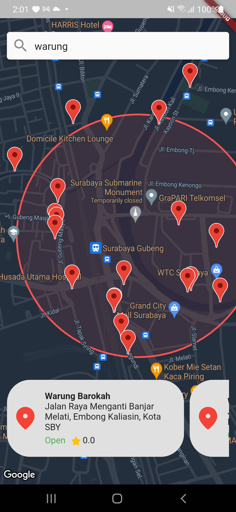

# nearby_place
Searching nearby place using Google Map ❤️ Made in flutter

## PREVIEW
 

## GETTING STARTED
Here you can get the API key for Google Maps SDK:
https://developers.google.com/maps/documentation/android-sdk/get-api-key

The following enabled API are:
  - Maps SDK for Android
  - Maps SDK for iOS
  - Places API

Also, you need a project with a billing account and the Maps SDK for Android enabled

## OPEN-SOURCE LIBRARIES
- [http](https://pub.dev/packages/http)
- [google_maps_flutter](https://pub.dev/packages/google_maps_flutter)
- [google_fonts](https://pub.dev/packages/google_fonts)

## HOW TO BUILD

### Android
Specify your API key in the application manifest `android/app/src/main/AndroidManifest.xml`:
```xml
<manifest
  <application
  ...
    <meta-data android:name="com.google.android.geo.API_KEY"
               android:value="YOUR KEY HERE"/>
  ...
  </application>
</manifest>

```

Then, change the constant API KEY at `models/constant.dart`
```dart
const String API_KEY = 'API-KEY';
```

## Supports :coffee:
If you feel like support me a coffee for my efforts, I would greatly appreciate it. <br><br>
<a href="https://www.buymeacoffee.com/radikz" target="_blank"></a>


